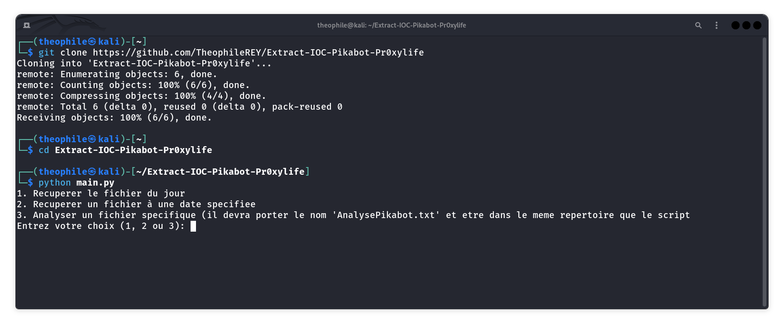

# Extract-IOC-Pikabot-Pr0xylife
## Description
Ce programme permet de télécharger et extraire les IOC des "rapports" de [@pr0xylife](https://github.com/pr0xylife/), notamment des adresses IP, des hash et des FQDN liés à Pikabot et TA577.

## Screenshot

